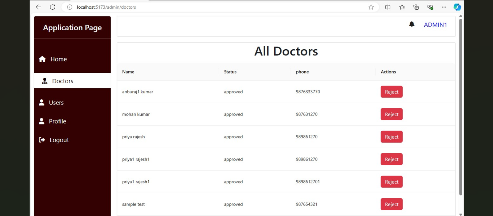

# Online Counseling Platform

## **Like mental health, relationship advice, and career counseling**

### Overview
### ---------------------------------------------------------------------------------------------------
##   Online Counseling System is a web application developed for Online Communication. The app has both user and doctor, admin functionalities.

### WorkFlow Documentation ###

### (https://www.canva.com/design/DAGRjGdfSTs/MrZQlYOeCSL1bVr885aogw/editreferrer=data-flow-diagrams-landing-page) ###

### Postman Documentation ###

### (https://documenter.getpostman.com/view/14490009/2sAXqzXJt4) ###

## Features

### 🔒 User Authentication: Users can sign up, log in, and manage their profiles. ###
### 🛠️ Admin Panel: Admin users can manage  users,doctor and bookings. ###
###     Booking: Users can search for available time, view details, and book Appointments. ###

## 💻 Tech Stack
### ----------------------------
### 🖥️ Front-end: Reactjs
### 🗄️ Database: MongoDB

## 🚪 Admin Credentials
### ------------------------------------------------------
### To access the admin panel, use the following credentials:

### 📧 Email: admin1@gmail.com
### 🔒 Password: admin1

## 👥 Doctor Credentials
### -------------------------------------------------------
### To test doctor functionalities, use the following credentials:

### 📧 Email: sudhan@gmail.com

### 🔒 Password: sudhan

## 👥 User Credentials
### -------------------------------------------------------
### To test user functionalities, use the following credentials:

### 📧 Email: kala@gmail.com

### 🔒 Password: kala

   
### http://localhost:8080/api/v1/user/register
### http://localhost:8080/api/v1/user/login
### http://localhost:8080/api/v1/user/getUserData
### http://localhost:8080/email/sendEmail
### http://localhost:8080/api/v1/doctor/doctor-appointments
### http://localhost:8080/api/v1/doctor/update-status
### http://localhost:8080/api/v1/admin/getAllUsers
### http://localhost:8080/api/v1/admin/getAllDoctors
### http://localhost:8080/api/v1/admin/changeAccountStatus
### http://localhost:8080/api/v1/user/apply-doctor
### http://localhost:8080/api/v1/user/get-all-notification
### http://localhost:8080/api/v1/user/getAllDoctors
### http://localhost:8080/api/v1/user/book-appointment
### http://localhost:8080/api/v1/user/user-appointments
### http://localhost:8080/api/v1/doctor/getDoctorById
